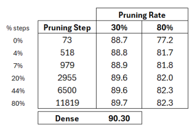
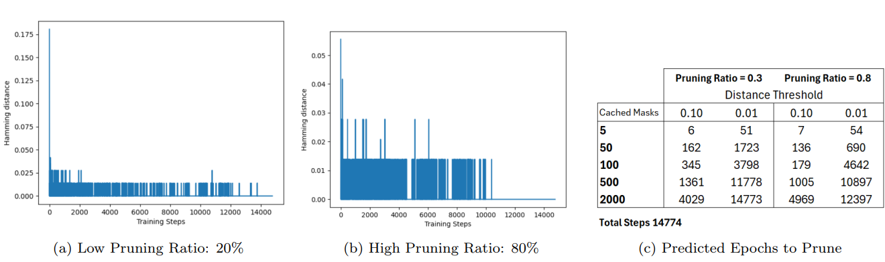
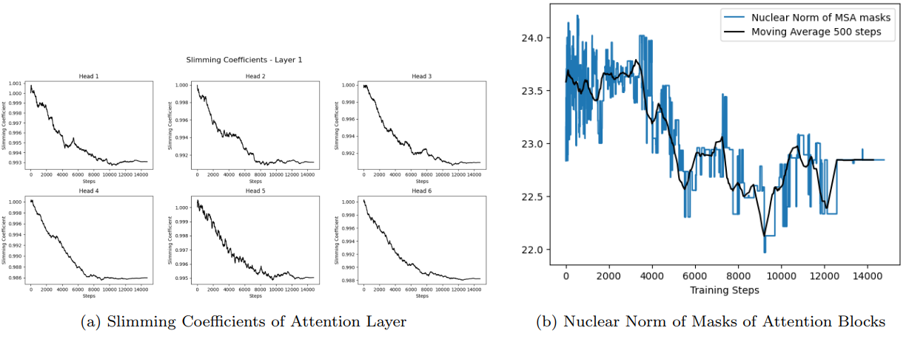
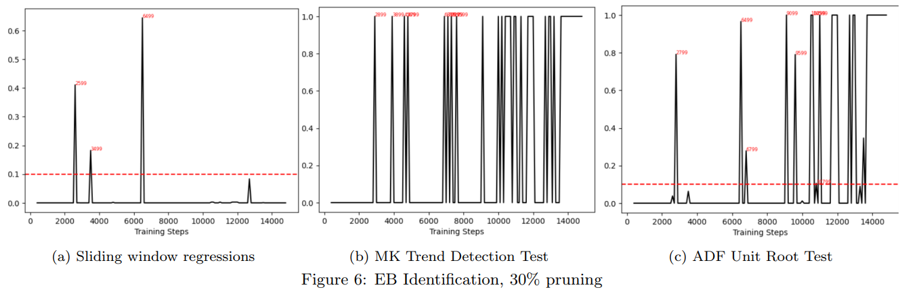
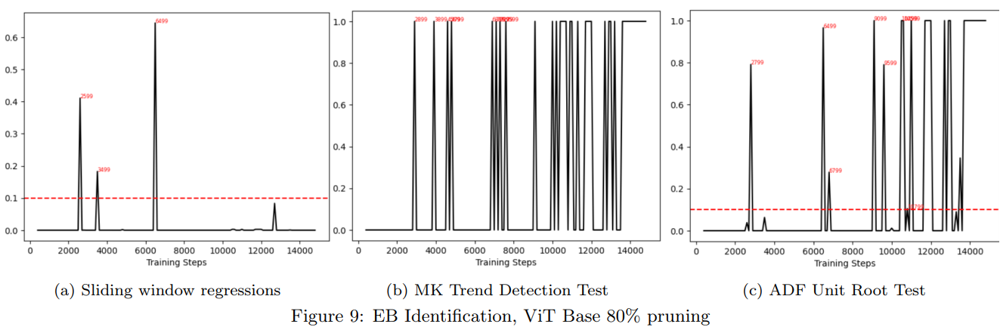

# Case Study - Early Identificatioin of Lottery Tickets on ViT

This is a case study of early identification of Lottery Tickets [1] (also called 'Early Birds', or EB for short) in Transformer architechtures, taking as an example Google's ViT base model finetuned for image classification on ImageNet1K.

# ViT-Base accuracy for different pruning ratios at different stages
The table shows the accuracy of the ViT model pruned at different stages of finetuning. We see that pruning at ⩾ 20% (~2955th) of steps is desirable, as it gives an accuracy closer to the dense counterpart. 

# The challenge with the Traditional EB strategy
The traditional strategy for EB identification involves taking the Hamming Distances of pruning masks, deciding to prune and retrain the network as soon as the masks "stabilize" [2], [3]. This method has been shown to consistently identify adequate stages to prune networks in a ange of CNN-based architechtures very early in training [2].

However, consider figures (a) and (b) below, which shows the Hamming Distances between consecutive pruning masks for the Multi Head Self Attention (MSA) blocks observed during finetuning of Google’s Base ViT model. We see the masks degenerates to a few values as soon as in the first few hundred steps (of 14774), especially for high pruning ratios. Table (c) shows the steps the corresponding EBs would be drawn given different parametrizations. Using 5 masks and 0.1 as a threshold to
determine masks are sufficiently close (baseline in [2]), tickets are drawn in the 6th step which is too early to draw a good performing model (see figure 5). Using more conservative parameters improves on this, but tickets tend to be drawn either in the first hundred steps or much later in the finetuning. Notably, this behavior is particularly stronger for the MSA blocks, occurs for a range of variations, including ViT and language models, and the same behavior is not observed for the feed-forward blocks.

Despite the challenges of EB identification with Hamming Distances, the slimming coefficients presents a smooth and homogeneous convergent shape, as shown in the figure below, suggesting that early-pruning should be doable. With effect, we see a similar convergent behavior when considering the nuclear norm of the masks induced by those coefficient. The identification of stationary regions such as these is a classical problem in time-series, with a series of techniques and dedicated statistical tests. 

# Proposed Strategy

Given these observations and the challenges explained above, I propose
the following strategy for EB identification.

Given these observations and the challenges explained above, I propose the following strategy for EB identification.
Pre-specify: 
- (i) A smoothing metric for the nuclear norm; 
- (ii) A window size and metric to evaluate stationarity;
- (iii) how often to try drawing an EB. In this case study, I use a simple moving average of 200 steps, sliding windows of 300 steps and try draw an EB every 100 steps.

During training: 
- (i) Cache the nuclear norm of pruning masks; 
- (ii) every 100 steps, compute the smoothed norm and apply the stationarity measure considering its last 300 observations; 
- (iii) prune if the stationarity measure falls/surpasses a threshold. 

For this case study, I use the following stationarity metrics:
- (a) A simple metric based on a sliding window regression norm = βt + c. Note that β = 0 indicates a flat line,
which I asses via its (serial-correlation robust) p-value, pruning if it goes above 20%.
- (b) The p-value for the MK trend detection test [18] [19] [20], pruning if it goes above 20%.
- (c) The p-values of ADF unit-root test [21], pruning if it goes below 5%.

# Results
The two figures below shows the steps where the proposed method draws the networks for pruning using 30% and 80% of pruning ratios. The method tends to consistently draw the tickets at >= 17% of steps, close to the steps at which the pruned model tends to show better performance. Also, notice the increased occurrence of drawings at the end of the training stage, consistent with
more stable behavior of model weights.

# References
[1] J. Frankle and M. Carbin. The lottery ticket hypothesis: Finding sparse, trainable neural networks. arXiv preprint arXiv:1803.03635, 2018.

[2] H. You, C. Li, P. Xu, Y. Fu, Y. Wang, X. Chen, R.G. Baraniuk, Z. Wang, and Y. Lin. Drawing early-bird
tickets: Towards more efficient training of deep networks. arXiv preprint arXiv:1909.11957, 2019.

[3] X. Chen, Y. Cheng, S. Wang, Z. Gan, Z. Wang, and J. Liu. Earlybert: Efficient bert training via early-bird
lottery tickets. arXiv preprint arXiv:2101.00063, 2020.

